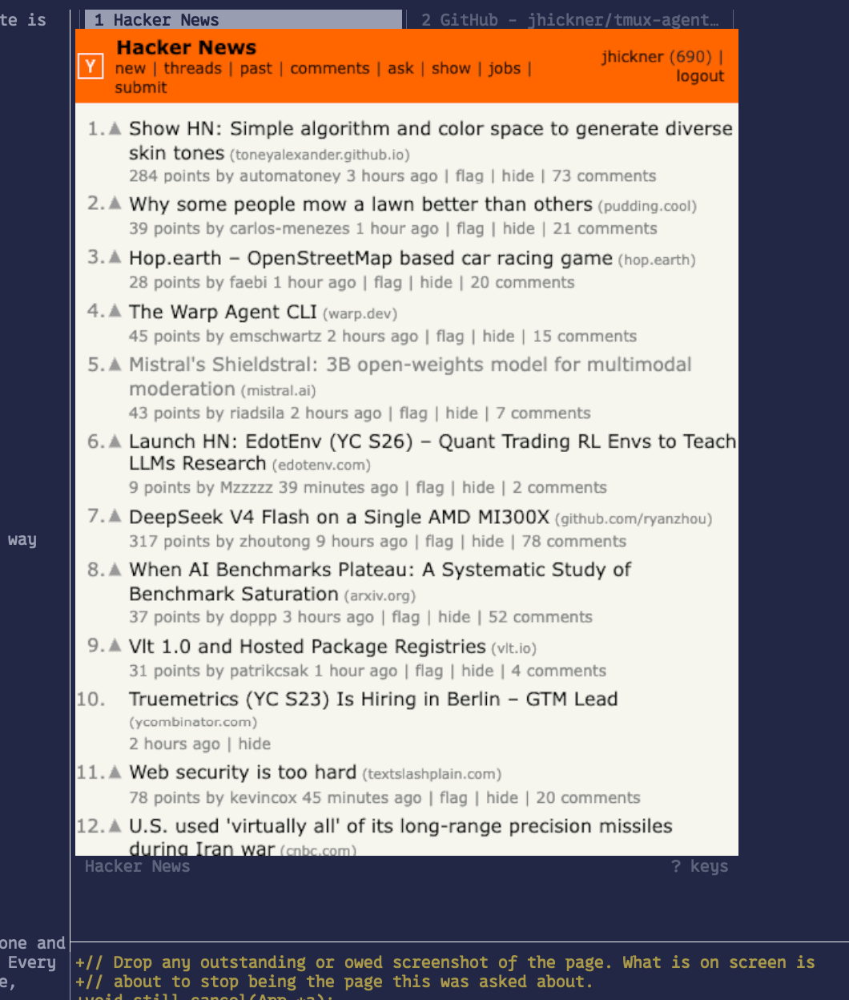

# web



Chrome in your terminal. Mostly. Sort of. 
This project uses Chrome's screencast capability combined with kitty graphics
to stream a browser window (with tabs) inline, into your terminal. It works
surprisingly well. It even works in tmux, although it's a bit slower.

`web` runs headless Chrome, streams the page over the DevTools protocol, and
draws each frame with the kitty graphics protocol. Keyboard and mouse go back
the other way, so pages are live: links click, forms type, wheels scroll.

If you like running things in your terminal, check out these other projects:
- [rom](https://github.com/jhickner/rom) - a terminal game emulator (gba, snes, etc.)
- [pix](https://github.com/jhickner/pix) - a terminal image viewer with grid layout
- [vid](https://github.com/jhickner/vid) - a terminal video player with subtitle
support

## Quick start

Requires [Ghostty](https://ghostty.org/) or [kitty](https://sw.kovidgoyal.net/kitty/),
Google Chrome, and a C compiler. No libraries to install.

```sh
make
./web news.ycombinator.com
```

Each address after the first opens in a tab; the window starts on the first:

```sh
./web news.ycombinator.com lobste.rs example.com
```

In tmux, add to `~/.tmux.conf`:

```sh
set -g allow-passthrough all
```

## Logins

Headless Chrome is usually blocked from signing in. Open a normal browser on
the same profile, log in to whatever sites you need, and `web` keeps that
session:

```sh
web --login
```

## Keys

| Key | Action |
|---|---|
| `^L` | address bar; a plain phrase becomes a search |
| `^O` / `^P` | back / forward |
| `^R` | reload |
| `^Y` | copy the page selection, or the address if nothing is selected |
| `^E` | open this page in the desktop browser |
| `^G` | devtools port, frame size, write time, throughput |
| `^D` | start or stop a trace into `/tmp/web_input.log` |
| `^S` | hide or show the status line |
| `^Q` | quit |
| `^T` / `^W` | new tab / close tab (the last one closes the window) |
| `^N` / `^B` | next tab / previous tab |
| `alt+1`…`alt+9` | go to that tab |
| `alt+0` | reset zoom, pinned width, and window proportion |
| `alt+f` | fit-to-width on/off |
| `cmd+c` | copy the page selection |
| `cmd+v` | paste into the page, or into the address bar when it is open |
| `^X` | open or close the console |
| `?` | key list over the page; any key dismisses it |
| mouse | click, drag to select, wheel to scroll |
| tab bar | click to switch, middle-click to close, wheel to cycle |

While reading:

| Key | Action |
|---|---|
| `↓` / `↑` | down / up a line |
| `←` / `→` | passed to the page |
| `backspace` / `shift+backspace` | back / forward |
| `j` / `k` | down / up |
| `h` / `l` | left / right, for a page wider than its given width |
| `d` / `u` | half a screen |
| `space` / `b` | a screen |
| `gg` / `G` | top / bottom |
| `[` / `]` | zoom out / in; inline, scales the window from both edges |
| `shift`+`↑↓←→` | drag one window edge (`U`/`D`/`L`/`R` too) |
| `w` / `W` | widen / narrow the width the page is told it has |
| `s` | frame size: auto, 100%, 75%, 50% |
| `t` | frame transport: png, then two jpeg settings |
| `y` | copy the address to the clipboard |
| `/` | find in page, then `n` / `N` |
| `P` | picking: click the page for a CSS selector, into the console |
| `i` | hand the keyboard to the page |
| `:` | open the console |
| `?` | key list; `j` / `k` to scroll it |
| `esc` | take the keyboard back |

## Options

```
web [options] <url>...

--scale F   hold the frame at F of the viewport (default auto: full size
            when the page is still, smaller while it moves). Above 1 does
            nothing; the screencast never exceeds the viewport
--zoom F    page magnification (default 1.0)
--rows N    how many cell rows the window gets
--no-status start with the status line hidden (^S toggles it)
--no-clear  leave the window on screen on exit instead of erasing it
--full      take over the whole terminal instead of drawing a window
--show      run Chrome with a visible window too
--mute      start with the page's audio switched off
--eval JS   run javascript in the page and print what it answers
--delay MS  pause between lines of piped javascript
--step      wait for a key between those lines
--timeout S how long a line waits before giving up (default 5)
--json      script output as one JSON object per value
--screenshot F   write the page to F as a png and exit; "-" is stdout
--login     open a window to sign in with, on the same profile
--keep      leave Chrome running on exit, for this window and every other
--endpoint  print every running window as JSON and exit
--browsers  list the Chrome processes web has running, with pids, and say
            which a new window could adopt
--kill      quit this profile's windows and end its browsers, including
            any nothing can reach
--exec CMD  run CMD against this window, its output in the console
--port N    fix Chrome's devtools port instead of letting it pick one
--no-pause  keep drawing while the terminal is not focused
--raw-keys  let a key the page did not want reach the window system
```

`--browsers` lists the Chrome instances `web` has started:

```
$ web --browsers
pid 25495   up 04:11        port 53859
```

```
$ web --browsers
pid 50596   up 26:00        stranded - nothing can reach it
web: 1 stranded browser holding the profile; web --kill ends it
```

`--kill` ends them:

```
$ web --kill
web: window 15902 is running but is not this profile's to end; kill 15902 if it is yours
```

## Screenshots

`--screenshot` writes the page to a PNG and exits:

```sh
./web --screenshot shot.png example.com
./web --screenshot - example.com | pngtopam        # "-" is stdout
echo 'document.querySelector("#accept").click()' |
    ./web --screenshot shot.png example.com
```

## Scripting

`--eval` and piped stdin both run JavaScript in the page:

```sh
./web --eval 'document.title' example.com
./web example.com < check.js                     # a file needs no flag
echo 'document.links.length' | ./web --json example.com
```

Stdin is read a line at a time whenever it is not a terminal. Each line goes to
the page's `eval`, so it need not be an expression — the completion value is the
answer, as in devtools:

```
document.title
let n = document.links.length; n * 2
location.href = "https://example.org"
document.querySelector("h1").textContent
```

Values go to stdout, one per line, while the page goes to the terminal, so
`./web example.com < s.js | jq` works. `--json` wraps each value in an object
with the line that produced it. A line that throws prints to stderr and exits
non-zero. A line that starts a navigation is not finished until the page has
arrived.

`--delay MS` paces the run, `--step` waits for a key between lines, `--timeout S`
caps one line.

## The console

`:` while reading, or `^X` at any time, opens a line editor under the page;
either closes it. It has history, `^R` search, and emacs kill bindings. `esc`
hands the keyboard back with the console still up, as does clicking the page.

What you type is JavaScript, evaluated in the page:

```
> document.querySelectorAll('a').length
42
> let seen = new Set(); for (const a of document.links) seen.add(a.host); [...seen]
news.ycombinator.com,github.com
> location.href = 'https://example.com'
```

Lines join the same queue `--eval` uses. Shift+Enter adds an input line, Page
Up/Page Down or the wheel scrolls the transcript, Enter runs.

`P` while reading toggles picking: clicking the page writes the shortest CSS
selector for what you hit into the console instead of activating it.

## Remote control

`--port` pins the devtools port so Playwright can connect:

```sh
./web --port 9222 news.ycombinator.com
```

```js
const browser = await chromium.connectOverCDP('http://127.0.0.1:9222');
```

`^G` shows the port when Chrome picked one itself. The port names the browser,
not the page, so `--endpoint` reports every running window as one JSON object
per line, without starting a browser:

```console
$ web --endpoint
{"pid":4123,"port":9222,"cdp":"http://127.0.0.1:9222","target":"0A32…","url":"https://example.com/","title":"Example Domain"}
```

Playwright has no accessor for a target id, so match it per page:

```js
const browser = await chromium.connectOverCDP(cdp);
const ctx = browser.contexts()[0];
for (const page of ctx.pages()) {
  const s = await ctx.newCDPSession(page);
  const { targetInfo } = await s.send('Target.getTargetInfo');
  if (targetInfo.targetId === target) { /* the page on screen */ }
}
```

`examples/attach.mjs` is that loop, ready to import. Playwright is not required:
CDP is a websocket taking JSON, and Node has had `WebSocket` and `fetch` built
in since 22. `examples/cdp.mjs` is that connection in standard library only, and
`examples/drive.mjs` is a demo written against it:

```sh
node examples/drive.mjs                 # against the one window running
web --exec 'node examples/drive.mjs' news.ycombinator.com
```

### --exec

`--exec` starts a program with the endpoint in its environment and puts its
output in the console while the page stays live above it:

```sh
web --exec 'node examples/attach.mjs' example.com
```

The child gets `WEB_CDP_URL`, `WEB_CDP_PORT`, and `WEB_TARGET_ID`. Quitting the
window ends it; it ending leaves the window. Both streams go to the console.

### attach

To go the other way, start the browser from Playwright and take it over:

```js
const browser = await chromium.launch({args: ['--remote-debugging-port=9222']});
```

Then `attach 9222`, typed in the console or run from a script:

- The browser `web` started is shut down unless `--keep` said otherwise. The one
  it attached to is never shut down; quitting leaves it running.
- `--keep` is asked of the browser, not the run: while any window has asked for
  this browser to stay, no window's quit will shut it down. The request dies
  with the browser.
- The device metrics override goes on their page too, so Playwright sees the
  viewport the frames are drawn at.
- `--port N` against a browser already answering there takes it over rather than
  starting a second, which is what makes `--keep --port` work. With no address
  it leaves that browser on whatever page it is on.
- Unless that browser is one of ours: a run records the port it started Chrome
  on, so a later `--port` at the same browser knows it is an earlier run's, takes
  a tab of its own, and can shut it down like any other run.

## Zoom and width

`[` and `]` change the *viewport width* rather than magnifying pixels, so the
page reflows: text gets genuinely larger and responsive sites drop to their
narrow layout.

After each change `web` asks the page whether it still fits, and a page that
cannot reflow that narrow gets its viewport widened back until it does. The
status line says so (`zoom 77% - page needs 1240px`) and the stored zoom drops
to what the page allowed.

`alt+f` turns fitting off if you would rather have the magnification and scroll
sideways with `h` and `l`. `alt+0` resets to 100%.

A width pinned with `w` or `W` is exempt and honoured whether the page fits it
or not. The measurement still runs — `width 360px - page needs 980px` — and what
does not fit is reached with `h` and `l`.

## Environment

| Variable | Effect |
|---|---|
| `WEB_CHROME` | path to a different Chrome build |
| `WEB_CELL` | `WxH` cell size, if the page aspect looks stretched. A terminal reporting no pixel geometry leaves it a guess (8x17 default); `^G` says which you have |

## How it works

```
Chrome ──Page.screencastFrame──> base64 PNG ──> kitty graphics ──> terminal
   ^                                                                  |
   └────────── Input.dispatchKeyEvent / dispatchMouseEvent ───────────┘
```

Chrome hands out frames as base64-encoded PNG and the kitty protocol accepts
base64 PNG directly, so a frame is never decoded or re-encoded on the way
through — it is copied from a websocket into an escape sequence.

Scrollbars are turned off, scrolling is one jump rather than an animation, and
pointer moves collapse while a frame is being written.
